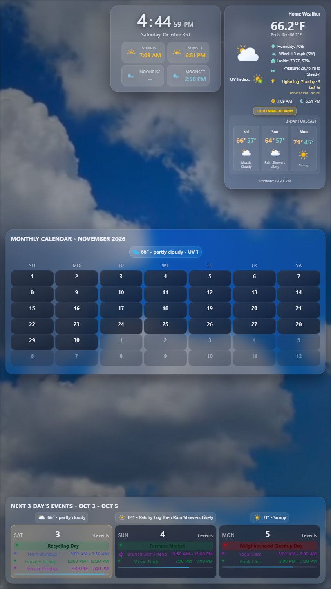

# MMM-AnimatedWeatherBackgrounds

Full-screen looping video backdrops that change with the current weather condition and
time of day. Meant to sit behind the other modules on a MagicMirror page.

## Screenshot

<p align="center">
  
</p>

*A full portrait page with the partly-cloudy daytime video behind the other Glass modules (calendar
events are sample data).*

## Install

No npm dependencies. Clone (or copy) this module into your MagicMirror `modules/` folder:

```
cd ~/MagicMirror/modules
git clone https://github.com/hearter20176/MMM-AnimatedWeatherBackgrounds.git
```

## Update

```bash
cd ~/MagicMirror/modules/MMM-AnimatedWeatherBackgrounds
git pull
```

Then restart MagicMirror (for example `pm2 restart MagicMirror`).

## Config

Use `position: "fullscreen_below"` on the module entry so it renders behind normal
modules (MagicMirror reads `position` from the module entry itself, not from `config`):

```js
{
  module: "MMM-AnimatedWeatherBackgrounds",
  position: "fullscreen_below",
  config: {
    opacity: 0.7,
    blur: "1.5px",
    vignette: 0.32
  }
},
```

### Page-scoped usage (MMM-pages)

To show the backdrop on one page only, give the entry the page class:

```js
{
  module: "MMM-AnimatedWeatherBackgrounds",
  position: "fullscreen_below",
  classes: "page1",
  hiddenOnStartup: true, // avoid a boot-time fade over the first page
  config: {}
},
```

MagicMirror fades the module wrapper at the speed MMM-pages passes to `hide()`/`show()` (500 ms by
default), which is abrupt for a fullscreen video. The module overrides `hide()`/`show()` to use
`pageFadeDuration` instead, so the fade-out finishes before MagicMirror calls `suspend()` (the video
keeps playing while it fades, then pauses), and playback starts at the beginning of the fade-in (it
continues from its current position; the source is never reloaded). Scene changes keep being applied
while hidden, so the right scene is already loaded when the page appears. Rapid page flicking is
safe: a show during a pending hide cancels the pause. With `reduceMotion` the switch is instant.

### Options

| Option | Default | Description |
|---|---|---|
| `opacity` | `0.7` | Video opacity (0-1). Multiplied by 0.8 under `body.mm-day` so it doesn't wash out light-theme text. |
| `blur` | `"1.5px"` | CSS blur applied to the video. Forced to `0px` when `performanceProfile` resolves to `"pi"`. |
| `vignette` | `0.32` | Alpha (0-1) of the radial vignette drawn over the video. Black at night, a light veil under `body.mm-day`. |
| `videoPlaybackRate` | `1` | Default `playbackRate` for scenes that don't set their own. |
| `transitionSpeed` | `800` | Duration (ms) of the video opacity transition - covers both the day/night dim change and, when `crossfade` is active, the crossfade between scenes. There is no fade-in on first render (the first video is already marked visible before it's inserted into the page, so it just appears once its first frame decodes). |
| `crossfade` | `"auto"` | Whether a scene change (e.g. clear -> rain) crossfades between two stacked `<video>` layers instead of swapping `src` on one element. `"auto"` crossfades unless `performanceProfile` resolves to `"pi"` or `reduceMotion` is on, in which case it falls back to a hard cut to save GPU/CPU on constrained hardware. `true` forces the crossfade on regardless of profile; `false` forces a hard cut. Only one layer is ever left playing/decoding once a crossfade completes - the outgoing layer is paused and its `src` released. |
| `performanceProfile` | `"auto"` | `"auto"` detects a Raspberry Pi from the user agent; `"pi"` or `"full"` force a profile. On `"pi"`, blur is disabled and (unless `crossfade` is forced `true`) scene changes use a hard cut instead of a crossfade. |
| `reduceMotion` | `false` | When `true`, videos load and show their first frame only; nothing decodes/plays. Also forces a hard cut between scenes unless `crossfade` is forced `true`. |
| `pauseWhileHidden` | `true` | Pause the video once the module is hidden (e.g. when another MMM-pages page is shown) and play it again when shown. |
| `pageFadeDuration` | `1500` | Fade duration (ms) when the module is hidden/shown, replacing the (shorter) speed the caller passes to `hide()`/`show()`. `0` keeps the caller's speed. Ignored (instant) when `reduceMotion` is on. See "Page-scoped usage". |
| `spriteSheets` | see `MMM-AnimatedWeatherBackgrounds.js` | Map of scene name -> `{ day, night }` video paths (relative to the module folder, or absolute/`http(s)://`/`data:` URLs). Scenes: `clear`, `partly_cloudy`, `cloudy`, `rain`, `sleet`, `thunderstorm`, `snow`, `fog`, `wind`, `default`. |

## Notifications consumed

- `CURRENTWEATHER_TYPE` (`{ type }`) - from MagicMirror's core `currentweather` module. `type` is matched against keywords (rain, snow, cloud, thunder, etc.) and, when it contains "day"/"night", used as the night hint.
- `WEATHER_UPDATED` (`{ currentWeather: { weatherType, sunrise, sunset } }`) - core weather module's combined update; `sunrise`/`sunset` feed the day/night calculation.
- `AMBIENT_WEATHER_DATA` (`{ condition, conditionCode, isDaytime, sunrise, sunset }`) - from MMM-AmbientWeather, if installed.
- `PAGE_THEME_CHANGED` (`{ mode: "day" | "night" }`) - from MMM-GlassClock. Used as a fallback night flag when no weather source has given an explicit day/night hint and no `sunrise`/`sunset` pair is known yet.
- `ANIMATED_WEATHER_BACKGROUND_SET` (`{ scene, spriteUrl, isNight, playbackRate }`) - manually force a scene. `scene` picks from `spriteSheets`; `spriteUrl` overrides the video entirely. Stays active until cleared.
- `ANIMATED_WEATHER_BACKGROUND_CLEAR` - drop the manual override and resume following weather notifications.

## Night detection order

1. An explicit day/night hint from the weather payload: `isDaytime` (only when the payload also carries `sunrise` and `sunset` - MMM-AmbientWeather defaults `isDaytime` to `true` when it has no lat/long to compute real sun times, so it isn't trusted on its own), or "day"/"night" in the weather type string.
2. `sunrise`/`sunset` timestamps from the weather payload, compared to "now".
3. The page theme (`PAGE_THEME_CHANGED` / `body.mm-day` / `body.mm-night`, set by MMM-GlassClock from real sun times).
4. A fixed local-time guess (day 06:00-19:00) if none of the above are available yet.

## Testing without a weather source

From the browser devtools console:

```js
const awb = MM.getModules().withClass("MMM-AnimatedWeatherBackgrounds")[0];
awb.notificationReceived("ANIMATED_WEATHER_BACKGROUND_SET", { scene: "rain", isNight: false }, awb);
```

`MM.sendNotification` intentionally skips the sending module, so calling
`awb.sendNotification(...)` on itself never delivers - call `notificationReceived` directly
as shown above, or send `ANIMATED_WEATHER_BACKGROUND_SET` from a different module/notification
source.

To go back to following real weather notifications:

```js
awb.notificationReceived("ANIMATED_WEATHER_BACKGROUND_CLEAR", null, awb);
```

## Assets

Videos live in `videos/` and are referenced by relative path in `defaults.spriteSheets`.
Shipped clips: `clear-day/night`, `partly-cloudy-day/night`, `cloudy-day/night`,
`rain-day/night`, `sleet-day` (sleet/hail at night reuses `rain-night`; snow/fog/wind reuse
the cloudy clips - swap in dedicated clips by overriding `spriteSheets` in config).
